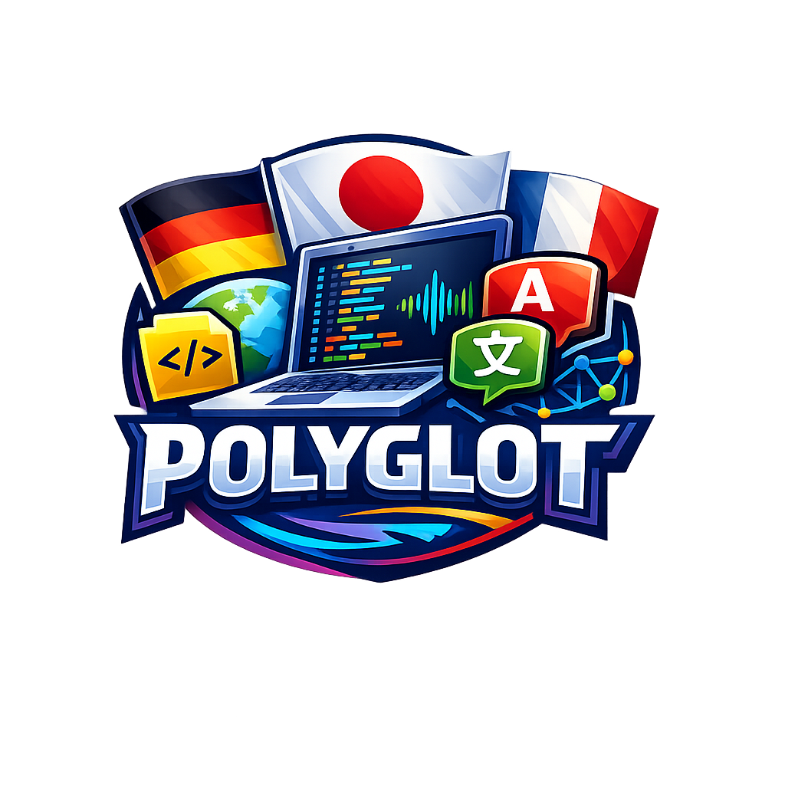

<p align="center">
  <strong>English</strong> | <a href="README.ja.md">日本語</a> | <a href="README.zh.md">中文</a> | <a href="README.es.md">Español</a> | <a href="README.fr.md">Français</a> | <a href="README.hi.md">हिन्दी</a> | <a href="README.it.md">Italiano</a> | <a href="README.pt-BR.md">Português</a>
</p>

<p align="center"></p>

<p align="center"><strong>Serveur de traduction MCP basé sur une unité de traitement graphique (GPU) locale, prenant en charge 55 langues, sans dépendance vis-à-vis du cloud.</strong></p>

<p align="center">
  <a href="https://www.npmjs.com/package/@mcptoolshop/polyglot-mcp"></a>
  <a href="LICENSE"></a>
  <a href="https://nodejs.org"></a>
  <a href="https://ollama.com/library/translategemma"></a>
  <a href="https://mcp-tool-shop-org.github.io/polyglot-mcp/"></a>
</p>

---

## Ce qu'il fait

Traduit du texte entre 55 langues en utilisant [TranslateGemma](https://ollama.com/library/translategemma), qui fonctionne localement sur votre GPU grâce à [Ollama](https://ollama.com). Pas de clés API, pas de cloud, pas de limitations de débit : tout fonctionne sur votre propre machine.

## Prérequis

1. **[Ollama](https://ollama.com)** installé et en cours d'exécution (`ollama serve`).
2. Modèle **TranslateGemma** téléchargé :
   ```bash
   ollama pull translategemma:12b   # 8,1 Go — meilleur équilibre entre qualité et vitesse
   # ou
   ollama pull translategemma:4b    # 3,3 Go — plus rapide, qualité inférieure
   ```
3. **Node.js 18+**

## Installation

### Claude Code / Claude pour ordinateur de bureau

Ajoutez les éléments suivants à votre configuration MCP (fichier `claude_desktop_config.json` ou `.mcp.json`) :

```json
{
  "mcpServers": {
    "polyglot": {
      "command": "npx",
      "args": ["-y", "@mcptoolshop/polyglot-mcp"]
    }
  }
}
```

### À partir de la source

```bash
git clone https://github.com/mcp-tool-shop-org/polyglot-mcp.git
cd polyglot-mcp
npm install && npm run build
node dist/index.js
```

## Outils

### `translate`

Traduisez du texte entre n'importe quelle paire de langues prises en charge.

| Paramètre. | Obligatoire. | Description. |
|-----------|----------|-------------|
| `text` | yes | Veuillez fournir le texte à traduire. |
| `from` | yes | Code de la langue source ou nom de la langue (par exemple, `en`, `anglais`). |
| `to` | yes | Code ou nom de la langue cible (par exemple, `ja`, `japonais`). |
| `model` | no | Modèle Ollama (par défaut : `translategemma:12b`). |

### `list_languages`

Veuillez énumérer les 55 langues prises en charge, ainsi que leurs codes respectifs.

### `check_status`

Vérifiez si Ollama est en cours d'exécution et quels modèles TranslateGemma sont installés.

## Langues prises en charge

Afrikaans, albanais, arabe, bengali, bulgare, catalan, chinois (simplifié), chinois (traditionnel), croate, tchèque, danois, néerlandais, anglais, estonien, finnois, français, galicien, allemand, grec, gujarati, hébreu, hindi, hongrois, indonésien, irlandais, italien, japonais, kannada, coréen, letton, lituanien, macédonien, malais, malayalam, maltais, marathi, norvégien, persan, polonais, portugais, roumain, russe, gaélique écossais, serbe, slovaque, slovène, espagnol, swahili, suédois, tamoul, télougou, thaï, turc, ukrainien, ourdou, vietnamien, gallois.

## Performance

Sur une carte RTX 5080 (16 Go de VRAM) avec le modèle TranslateGemma 12B (en version Q4) :

| Mesure. | Value |
|--------|-------|
| Première traduction (charge à froid). | ~15s |
| Traductions ultérieures. | Environ 600 millisecondes. |
| Utilisation de la mémoire vidéo (VRAM). | Environ 8,1 Go. |
| Veuillez fournir le texte à traduire. Je suis prêt à le traduire en français. | Environ 600 millisecondes par segment. |

## Comment ça fonctionne

1. Votre client MCP (par exemple, Claude Code) appelle l'outil `translate`.
2. Polyglot crée une requête pour le modèle TranslateGemma, en spécifiant la paire de langues source/cible.
3. Cette requête est envoyée à l'API HTTP locale d'Ollama.
4. Ollama exécute le modèle TranslateGemma sur votre GPU et renvoie la traduction.
5. Pour les textes longs, le contenu est divisé en segments aux limites des paragraphes ou des phrases.

## Licence

Licence MIT — voir le fichier [LICENSE](LICENSE) pour plus de détails.

Fait partie de [MCP Tool Shop](https://mcptoolshop.com).
